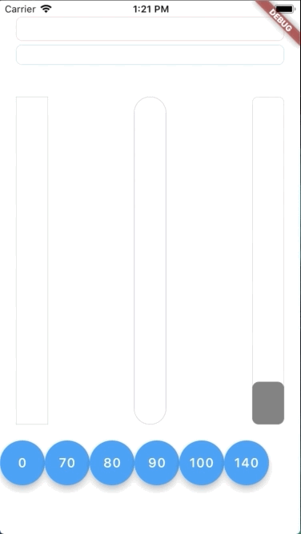

## Flutter Animation Progress Bar

This colorful [Flutter](https://flutter.io) widget package aims to show an animation progress bar in reactive style. It also supports both vertical and horizontal bar.




### Getting Started

In order to use this package, do import
```dart
import 'package:flutter_animation_progress_bar/flutter_animation_progress_bar.dart';
```

Basic implementation can be done like below code:
```dart
FAProgressBar(
  currentValue: 20,
  displayText: '%',
)
```

### Example App
You can find more examples from [Example App](example)


### API
In this table, you can find all attributes provided by this package:

| Attribute           | Default value                     | Description |
| ------------------- | --------------------------------- | -           |
| currentValue        | 0                                 | Set the current value for progress bar. This value should be in **stateful** so that whenever **setState()** has been called, the progress bar will trigger an animation from **latest currentValue** to **new currentValue** |
| maxValue            | 100                               | Max value to be displayed as progress bar. <br>*Current value can be greater than max value*  |
| size                | 30                                | The bar height if direction in Axis.horizontal. <br>The bar width if direction in Axis.vertical |
| animatedDuration    | const Duration(milliseconds: 300) |-|
| direction           | Axis.horizontal                   | The bar can be in **Axis.horizontal** or **Axis.vertical** direction |
| verticalDirection   | VerticalDirection.down            | With vertical direction, the bar can be **VerticalDirection.up** or **VerticalDirection.down** direction|
| borderRadius        | 8                                 | Set the bar border radius |
| backgroundColor     | Colors.transparent                | Set the bar background color |
| progressColor       | const Color(0xFFFA7268)           | Set the bar progressing color |
| changeColorValue    | ```null```                        | Set a value that progress color should be changed to <br> [0**<span style="color:blue">-----------</span>**[**70**]**<span style="color:red">-----</span>**100] |
| changeProgressColor |const Color(0xFF5F4B8B)            | Color that progress color will be changed to whenever **currentValue** greater than **changeColorValue** |
| displayText         | ```null```                        | Text to display belonging with currentValue. <br>Examples:<br> ```%``` -> ```20%```<br> ```°F``` -> ```80°F```|

### Objects
```dart
class FAProgressBar {

  final int currentValue;
  final int maxValue;
  final double size;
  final Duration animatedDuration;
  final Axis direction;
  final VerticalDirection verticalDirection;
  final double borderRadius;
  final Color backgroundColor;
  final Color progressColor;
  final int changeColorValue;
  final Color changeProgressColor;
  final String displayText;
}
 ```


### Feedback

Feel free to [leave any feedback](https://github.com/ltdangkhoa)
for helping support this package 🍻 
